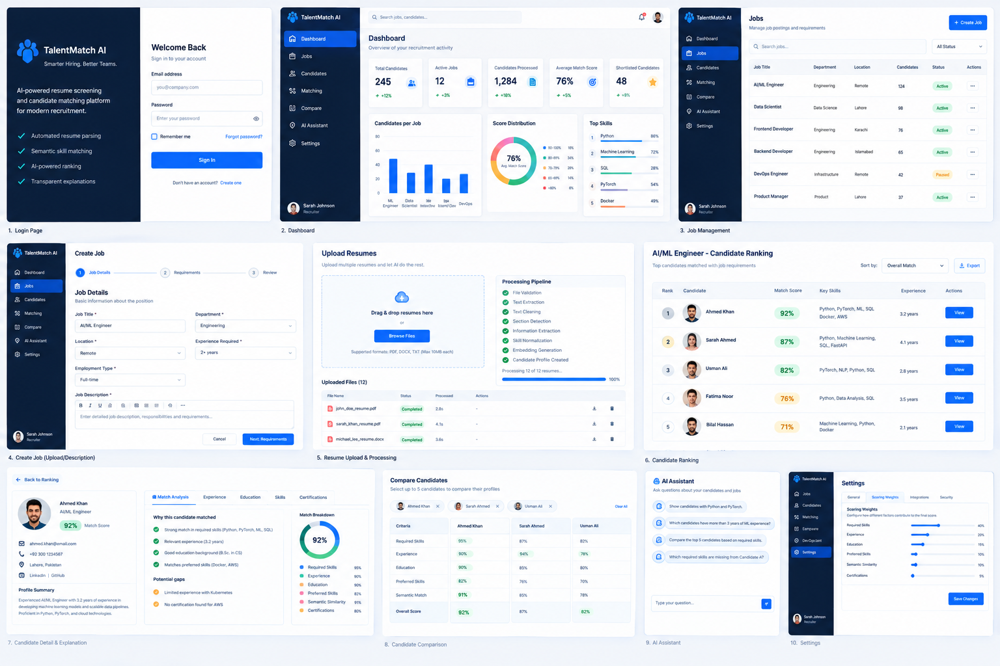

# TalentMatch AI

Recruitment decision-support platform: parse resumes and job descriptions, rank
candidates against a specific role with an auditable scoring model, and let
recruiters review the evidence behind every score.

**The system ranks and explains. It never rejects.** Scores are inputs to a human
decision; see [docs/responsible-ai.md](docs/responsible-ai.md).

- [docs/architecture.md](docs/architecture.md) - components, data flow, ranking internals
- [docs/api.md](docs/api.md) - all 51 endpoints, auth flow, request shapes
- [docs/security.md](docs/security.md) - threat model, controls, deployment hardening
- [docs/deployment.md](docs/deployment.md) - Docker, environment, migrations, backups
- [docs/model-card.md](docs/model-card.md) - scoring model, metrics, known limits
- [docs/responsible-ai.md](docs/responsible-ai.md) - what the system refuses to do
- [ml/README.md](ml/README.md) - offline reranking experiment and its result
- [prd.md](prd.md) - product requirements

## Product requirements



The full requirements specification this was built against is [prd.md](prd.md).

## Stack

| Layer | Technology |
| --- | --- |
| API | FastAPI, SQLAlchemy 2 (async), Alembic, Pydantic 2, JWT |
| Ranking | Deterministic weighted scorer, cosine text similarity, PostgreSQL/SQLite |
| Web | React 19, TypeScript 5, Vite, React Router 7, TanStack Query, Tailwind |
| ML | scikit-learn cross-validation, offline only, synthetic corpus |
| Delivery | Docker Compose (API + nginx + PostgreSQL), GitHub Actions CI |

## Quick start (local, no Docker)

```bash
# 1. Python environment
python -m venv .venv
.\.venv\Scripts\python.exe -m pip install -r requirements.txt     # Windows
source .venv/bin/pip install -r requirements.txt                  # macOS / Linux

# 2. Configuration
cp .env.example .env            # set SECRET_KEY and ADMIN_PASSWORD

# 3. Database schema
cd backend && python -m alembic upgrade head && cd ..

# 4. API on :8000
cd backend && python -m uvicorn app.main:app --reload
```

```bash
# 5. Web client on :5173 (separate shell)
cd frontend
npm install
npm run dev
```

Open http://localhost:5173 and sign in with `ADMIN_EMAIL` / `ADMIN_PASSWORD` from
`.env`. The bootstrap administrator is created on first startup; public
registration only creates recruiters.

The dev server proxies `/api` to `http://127.0.0.1:8000`, so no CORS
configuration is needed. Interactive API docs: http://localhost:8000/docs

## Quick start (Docker)

```bash
cp .env.example .env      # set SECRET_KEY and ADMIN_PASSWORD
docker compose --env-file .env -f docker/docker-compose.yml up --build
```

Open http://localhost:8080. nginx serves the built SPA and reverse-proxies `/api`
to the API container, so the browser only ever talks to one origin.

```bash
docker compose --env-file .env -f docker/docker-compose.yml logs -f api
docker compose --env-file .env -f docker/docker-compose.yml down      # stop
docker compose --env-file .env -f docker/docker-compose.yml down -v   # stop and delete data
```

## Verifying the build

```bash
# API: unit + integration tests
cd backend && python -m pytest

# ML pipeline: 57 tests
python -m pytest ml

# Web: lint, types, tests, production bundle
cd frontend
npm run lint
npm run typecheck
npm run test
npm run build

# Offline reranking experiment (writes a report to ml/runs/)
set PYTHONPATH=ml\src && .\.venv\Scripts\python.exe -m talentmatch_ml.cli all
```

Current status: API 51 tests pass, ML 57 tests pass, web lint/typecheck/build
clean and 14 web tests pass, and `npm audit --omit=dev` reports no production
vulnerabilities. GitHub Actions runs the same four jobs plus a container build on
every push.

> **Windows note.** `npm run lint`, `npm run typecheck` and `npm run build` work
> from this checkout even though the path contains spaces and `&`. `npm run test`
> does not: vite-node's ESM loader misparses a Windows path with those
> characters. Run the tests from a copy at a space-free path
> (`robocopy frontend C:\fe-run /E /XD node_modules dist`, then `npm ci` and
> `npm test` there), or use a path without spaces. CI on Linux is unaffected.

## Ranking in one paragraph

A candidate is scored against a job on six weighted components: required-skill
coverage (0.40), experience fit (0.20), education match (0.15), preferred-skill
coverage (0.10), text similarity (0.10) and certifications (0.05). Weights are
editable per weight profile and must sum to 1.0. Every component, plus the
matched and missing skills that produced it, is returned to the client so a
reviewer can disagree with the model on evidence. Unmatched required skills can
still be credited as *partial* when the resume as a whole is semantically close
to that skill (cosine >= 0.45).

## Offline ML experiment

`ml/` contains a reproducible experiment that asks whether a learned reranker
beats the shipped scorer. On a 48-job / 11,520-pair synthetic corpus it is
statistically tied on NDCG@5 (p = 0.511) while being better calibrated
point-wise. **Conclusion: keep the interpretable scorer.** Details and numbers in
[ml/README.md](ml/README.md) and [docs/model-card.md](docs/model-card.md).

## Project layout

```
backend/         FastAPI app, SQLAlchemy models, Alembic migrations, 51 tests
  app/api/       routers: auth, jobs, candidates, matching, assistant, admin
  app/ml/        embedder + scoring engine shared with the offline pipeline
  app/models/    ORM models
frontend/        React SPA
  src/pages/     dashboard, jobs, candidates, ranking, assistant, admin, auth
  src/components/ shared UI
ml/              offline reranking pipeline (not in the request path)
docker/          Dockerfiles, compose file, nginx config
docs/            architecture, API, security, deployment, model card, AI policy
.github/         CI workflow
```

## Configuration

All settings come from the environment via `.env`; `.env.example` documents every
variable. The ones that matter most:

| Variable | Purpose |
| --- | --- |
| `SECRET_KEY` | JWT signing key. Required, must be replaced before any real deployment. |
| `ENVIRONMENT` | `development` / `test` / `staging` / `production`. Controls seeding, docs exposure and debug errors. |
| `DATABASE_URL` | `sqlite+aiosqlite:///./storage/app.db` by default; PostgreSQL in Docker. |
| `ADMIN_EMAIL`, `ADMIN_PASSWORD` | Bootstrap administrator, created only when the user table is empty. |
| `EMBEDDING_PROVIDER` | `hashing` (offline, default in Docker), `openai`, `sentence_transformers`. |
| `LLM_PROVIDER` | `none` (default) or `openai`. Affects the assistant endpoint only. |
| `W_*` | Ranking weights; must sum to 1.0. |
| `RETENTION_DAYS` | Age at which candidate data becomes eligible for admin purge. |

## Security notes

Short version: passwords are bcrypt-hashed, access and refresh tokens are
separate JWTs, refresh tokens are revocable and hashed at rest, every query is
scoped to the authenticated user's organisation, resume files are served through
an authorised endpoint rather than a static mount, and rate limiting plus
`helmet` headers apply to the whole API. Protected attributes are structurally
excluded from ranking features. Full details, including what is *not* covered, in
[docs/security.md](docs/security.md).

## Limitations

- The ML numbers come from a synthetic corpus, not real hiring outcomes.
- `hashing` embeddings are a deterministic offline fallback, not a language
  model; semantic matching is meaningfully better with
  `EMBEDDING_PROVIDER=sentence_transformers` or `openai`.
- No automated rejection, no auto-screening out of the box, by design.
- Container images and CI have not been executed in every environment this code
  was authored in; see the status note in [docs/deployment.md](docs/deployment.md).

## Licence

MIT. See [LICENSE](LICENSE).